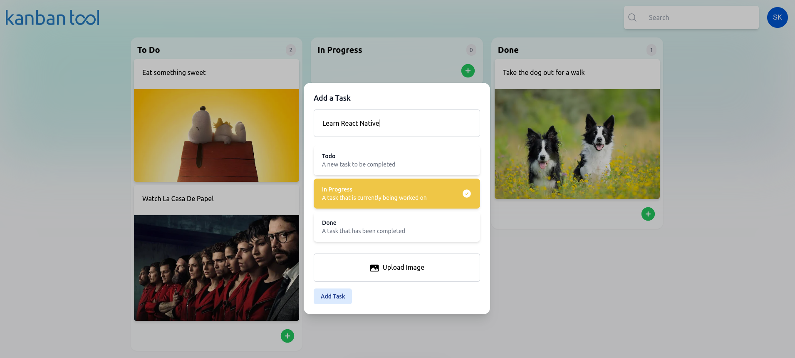
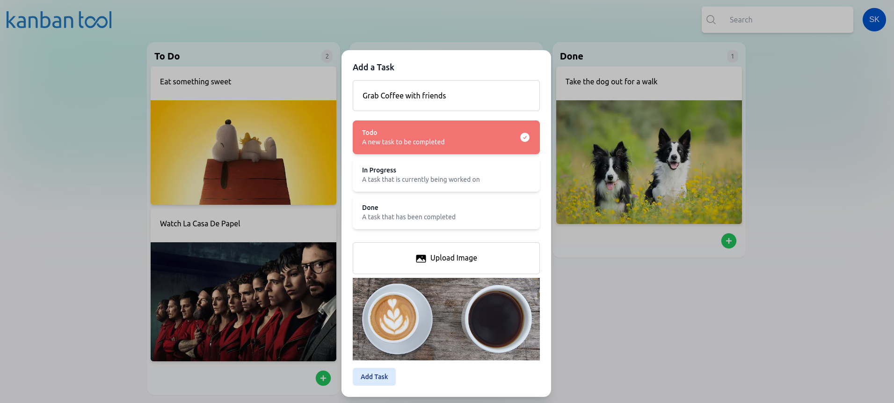
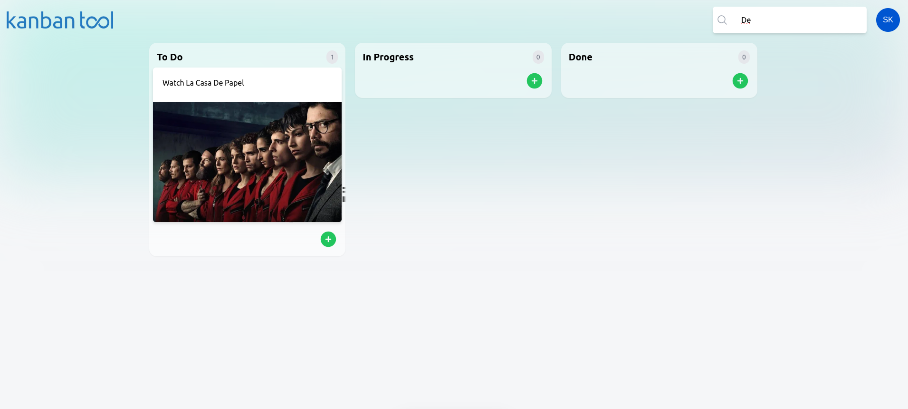
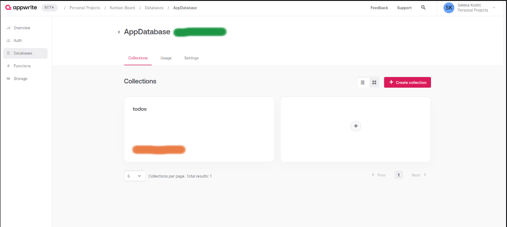
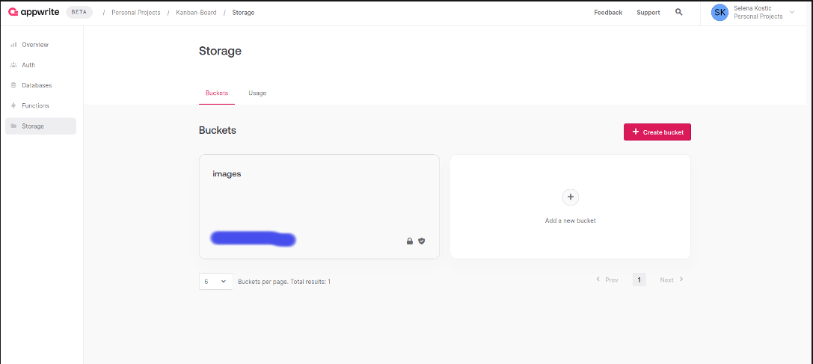

# Kanban Board

Welcome to the Kanban Board! A fun and interactive board which will help you organize your day to day tasks!🙌

The board consists of three columns: **To Do**, **In Progress** and **Done**.

You can:

- add new tasks into each column
- drag and drop tasks from one column to another as well as drag and drop tasks within the same column
- alternate the existing tasks
- Keep track of how many items are there in each column
- use the Search input field to get to you task faster
- delete them if you do not want them to be on the Kanban Board.

When creating a new task you can add:

- The title of the Task
- You can choose to which column you want to add that task to
- Optionally, you can even add an image to better represent what needs to be done in the task that is being created

#### Add new Task



#### Upload Image to a new Task



#### Search



## Use Kanban Board🎉

There are two ways to access the Kanban Board:

1. Directly to Vercel's deployed version

The first way is the easiest! Since the app is backed up with Appwrite and deployed via Vercel, you can easily access it by going on this [link](https://kanban-board-hpldmsinz-selena-kostics-projects.vercel.app/).

2. Setup the app Locally

2.0 In the app's codebase, create local .env.local file and populate it as follows:

```
NEXT_PUBLIC_ENDDPOINT_URL="https://cloud.appwrite.io/v1"
NEXT_PUBLIC_APPWRITE_PROJECT_ID= ...will be your local value
NEXT_PUBLIC_DATABASE_ID= ...will be your local value
NEXT_PUBLIC_TODOS_COLLECTION_ID= ...will be your local value
NEXT_PUBLIC_IMAGES_BUCKET_ID= ...will be your local value
```

2.1 Go to - https://appwrite.io/

2.2 Create new Account by signing up to Appwrite Cloud Platform

2.3 Create **New Project**

2.4 Choose **Web** as your preffered Platform and Register the app with the Name and Hostname (localhost should be entered in this field). You can skip the intallation of appwrite since it is already part of the _package.json_ file. When prompted with the title "Let's get coding", copy the string within **.setProject** brackets and copy it to the **NEXT_PUBLIC_APPWRITE_PROJECT_ID** that you previously added to your local env file
assets/
2.5 Go to the project's Dashboard

2.6. Go to **Databases** tab on the left side of the Panel and create a new Database. After you have done that, click on + Create collection button and name the collection "todos".

2.7 In the "todos" collection, go to "Attributes" tab on the top and add the following attributes:

- _title_ which is of type string, the size of 512 and required
- _status_ which is not required and is of type Enum with the following Elements: todo, Inprogress and done
- _image_ of type string, the size of 512 and not required

  2.8 After adding all attributes, go to Settings pannel at the top -> Update Permissions -> and allow anyone to create, read, update and delete

  2.9. On the right Panel, choose the Storage tab and click on + Create Bucket and create Bucket for storing images called "images"

  2.10. On images bucket, like for todos, go to Setings and Update Permissions to any for Create, read, update abd delete

  2.11. Now that you've set up Database, Todo and Images bucket, you need to grab their corresponding IDs and add them to your local .env file

  - NEXT_PUBLIC_DATABASE_ID -> green colored on the image

  - NEXT_PUBLIC_TODOS_COLLECTION_ID -> orange colored on the image

  - NEXT_PUBLIC_IMAGES_BUCKET_ID -> blue colored on the image





## Tech Stack

- The app is built upon Next.js, TypeScript and Ract
- [Zustand](https://github.com/pmndrs/zustand) and [Redux](https://redux.js.org/) are used for managing state
- For drag and drop functionallity, [React Beutiful DND](https://github.com/atlassian/react-beautiful-dnd)
- [Headless UI](https://headlessui.com/) is used for creating Modals
- [Tailwind CSS](https://tailwindcss.com/) is used for Styling
- [Appwrite](https://appwrite.io/) is an open-source platform used as a cloud provider for Storage and Database
- [Vercel](https://vercel.com/) is used for deploying the app
- [Jest](https://jestjs.io/) framework for tests
